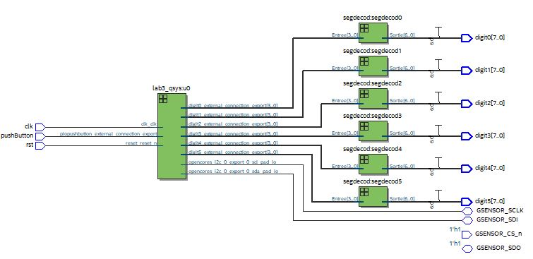

# FAUGERE_lab3

Ce programme affiche l'accélération de la carte selon les 3 axes en mg.

## FONCTIONNEMENT

Bouton KEY0 : RESET
Bouton KEY1 : Change l'axe sur lequel l'accélération est mesurée

## Périphériques utilisés

Un timer est utilisé pour récupérer et afficher les données toutes les secondes.
Un IP controleur I2C est utilisé pour gérer la communication I2C dans le soft via le bus Avalon-MM.

## DESIGN

 

